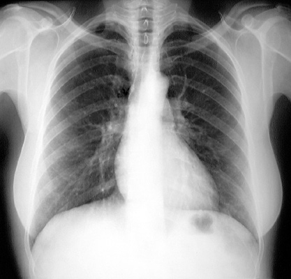

# 🏥 AI-Driven Medical Image Analysis
### Evaluation of MedSigLIP-448 for Zero-Shot Radiographic Diagnosis

**Author:** Ampika Jawana | Radiologic Technologist & Radiation Safety Officer (RSO)  
**Project:** Data Analyst Bootcamp #12  
**Date:** March 22, 2026  

[](https://www.python.org/)
[](https://pytorch.org/)
[](https://huggingface.co/)
[](https://colab.research.google.com/)

---

## 📋 Clinical Objective

To evaluate the **Zero-Shot performance** of the **MedSigLIP-448** (Medical SigLIP) Vision-Language Model in identifying common radiographic findings — specifically **Cardiomegaly** and **Lung Opacities** — without any prior task-specific training.

> 💡 This project uniquely combines clinical expertise as a Radiologic Technologist with data science skills to critically assess AI model performance in a real-world medical imaging context.

---

## 🔬 Technical Methodology

| Component | Details |
|-----------|---------|
| **Model** | `google/medsiglip-448` (Vision Transformer Architecture) |
| **Environment** | Google Colab (T4 GPU Accelerated) |
| **Inference Type** | Zero-Shot Image-to-Text alignment (Natural Language Supervision) |
| **Preprocessing** | 448×448 bilinear interpolation with standard medical normalization |

---

## 🩻 Case Study: Chest PA X-ray

**Modality:** Digital Radiography (DR) — Chest PA

<p align="center">
  
  <br>
  <sub><em>Figure 1: Chest PA X-ray (Lung_xray_sample.jpg) — Case study image used for Zero-Shot evaluation</em></sub>
</p>

### Clinical Assessment (Radiologic Technologist)
- Obvious enlargement of the cardiac silhouette
- Calculated **Cardiac-Thoracic Ratio (CTR) > 0.50** → consistent with Cardiomegaly

### AI Assessment Results

**Initial label set:**
| Finding | Confidence |
|---------|-----------|
| Normal Chest X-ray | ~56.95% |
| Cardiomegaly | ~15.76% |
| Pneumonia | ~16.49% |
| Pleural Effusion | ~10.80% |

> ⚠️ **Key Finding:** The model rated "Normal Chest X-ray" at ~57% confidence despite clear radiographic evidence of Cardiomegaly — illustrating a significant **Zero-Shot Gap**.

---

## 🔍 Technical Analysis: The Zero-Shot Gap

As a Radiologic Technologist and Data Analyst, three root causes were identified:

**1. Resolution Loss**  
Downsampling to 448×448 pixels causes loss of fine-edge definition at the heart borders, making borderline CTR cases harder to detect.

**2. Dataset Bias**  
The model's "Normal" weight is likely over-represented in training data, leading to a high **negative bias** in borderline cases.

**3. Prompt Sensitivity**  
Minor changes in label phrasing (e.g., `"pneumonia"` vs `"pnuemonia"`) caused up to **10% shift** in confidence scores — highlighting the critical importance of **Data Quality** and **Prompt Engineering** in clinical AI pipelines.

---

## 🗺️ Project Roadmap (Phase 2)

To improve sensitivity for Cardiomegaly detection:

- [ ] **Pre-processing:** Extract 16-bit CT-Scan slices with specific Mediastinum Windowing (Level/Width control)
- [ ] **Fine-Tuning:** Train MedSigLIP on a curated dataset of high-CTR images
- [ ] **Validation:** Compare AI-detected CTR against manual measurements from Radiologists

---

## 📁 Repository Structure

```
medsig-lip-xray-analysis/
├── MedSigLIP_-_Colab.ipynb   # Main notebook (Google Colab)
├── MedSigLIP_-_Colab.pdf     # Full project report
├── Lung_xray_sample.jpg             # Case study X-ray image
└── README.md
```

---

## 🚀 How to Run

1. Open `MedSigLIP_-_Colab.ipynb` in Google Colab
2. Accept the model license at [google/medsiglip-448](https://huggingface.co/google/medsiglip-448) on Hugging Face
3. Create a `HF_Token` in Colab Secrets (left sidebar → 🔑 Secrets)
4. Run all cells

---

## 💡 Key Takeaways

- Zero-Shot foundation models show **promising but limited** performance on specialized medical imaging tasks
- **Domain expertise** (clinical knowledge) is essential for correctly interpreting AI confidence scores
- **Prompt Engineering** significantly impacts model output — even small label changes shift results by ~10%
- Fine-tuning on domain-specific data will be critical for clinical deployment

---

## 👩‍⚕️ About the Author

Ampika Jawana is a Radiologic Technologist and Radiation Safety Officer (RSO) currently expanding into Data Science and AI. This project applies clinical domain expertise to critically evaluate AI models in medical imaging — bridging the gap between radiology and data science.

[](https://github.com/ampika-workspace)
